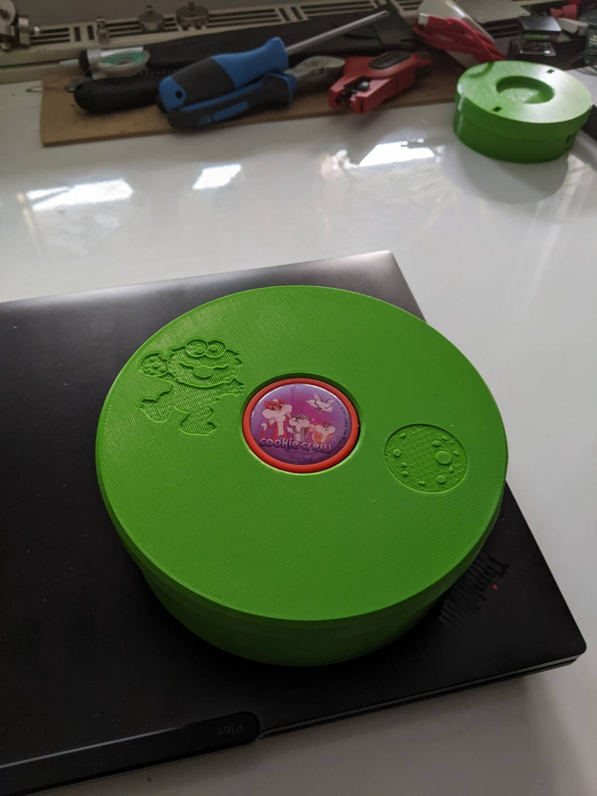
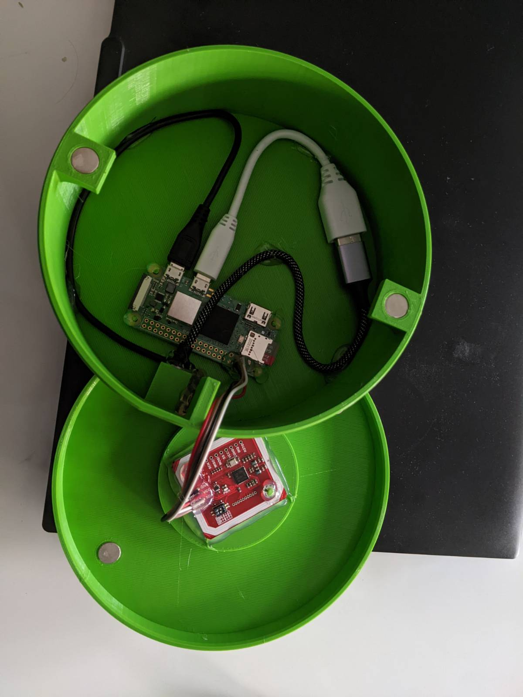

# 🍪 Keksbox 🍪

A magic keksbox (cookie box) that conjures a smile into every child's face.

<p align="center">
  
  
</p>

## Overview

The Keksbox is a homegrown music box that allows streaming of audio files/audiobooks to an external speaker. The usability is child-friendly, as it utilizes "keks" tags instead of traditional CDs or otherwise. Streaming to a loudspeaker instead of a headset lets us share fun and experience the audiobooks together. The box differentiates between a standard and custom audio set. The standard set should be "burned" to the device during setup, whereby the custom set can be adjusted at any time via a web-based portal. This allows parents to assign each "keks" a default audio file, and the children can overwrite it with their audio files.

The project aims to demonstrate that everybody with a basic background can develop nice products. Studying a programming language or software architecture for years is unnecessary. Instead, managing to empower Linux is sufficient to build starving products.

## Key Features

- **kekz audio playback**: [kekz][kekz] NFC tags compatible 
- **Minimal code approach**: Utilizes existing Linux tools instead of custom software.
- **Web-based file management**: Includes a web interface for uploading and managing custom NFC tag files.
- **Web-based system management**: Includes a web interface to control the device via ssh.
- **Lightweight architecture**: Built entirely with standard Linux utilities.

## Usage

1. Place an NFC tag on the reader.
2. The system will:
    - Detect the tag using `libnfc`.
    - Look up the associated audio file.
    - Play the audio using `play` from SoX.
3. Use the Filebrowser web interface to:
    - Upload new audio files.
    - Associate files with specific NFC tags.
    - Manage your audio library.

## Hardware Components

- **[Raspberry Pi Zero 2W][rp_zero]**: Main processing unit
- **[PN 532 NFC Reader][PN532]**: Reading NFC keks/tags
- **[USB Audio][usb_audio]**: USB audio adatper
- **[USB-C Port][usb_c_breakout]**: Power delivery port (with resistors)
- **3D-Printed Case**: Case printed via 3d printer 

## Software Components

- **[Raspberry OS][rp_os]** - Operating system for [Raspberry Pi Zero 2 w][rp_zero]
- **[Sound eXchange][sox]** - Simple audio player framework for terminal use
- **[filebrowser][fb]** - Web-Based file browser (github project)
- **[libnfc][libnfc]** - Linux package to read NFC tag
- **[i2c-tools][i2c_tools]** - Linux package for [i2c][i2c] communication
- **[bash][bash]** - Scripting and automation

## Kekz Heatset

This project does not aim to reveal or exploit any internal system structure of the kekz product. However, a german security research has demystified the headset in his blog post: [https://nv1t.github.io/blog/kekz-headphones/][https://nv1t.github.io/blog/kekz-headphones/]. This project builds on top of his research. Following his research allows you to extract the audiobooks from a headset and decode them into mp3 files.


## Installation

If you want to have your own keksbox, please follow the steps below:

### Hardware Wiring

Before we start with the firmware, let's get the wiring done. At first, we will connect the NFC reader to the correct GPIO pins. By checking the [PI's pinout][rp_pinout] we can conclude the following connections:

```
# NFC module pin -> Pi GPIO physical pin #
GND -> 6
VCC -> 4
SDA -> 3
SCL -> 5
```

Next, we connect the USB Audio device to the PI through a micro USB to USB type A connector. The final wiring is shown in the image below.

\# TODO: image

### Raspberry Pi Zero 2 W Setup

Please install the [Raspberry OS][rp_os] as explained in the official [tutorial][rp_install]. This project used the `x64 bit lite version` of the os hidden behind the `Raspberry Pi Os (other)` option. Using the official image tool directly lets you set the hostname, user, and, most importantly, the wifi connection. This project used the following configuration:
* hostname: rehkakeks
* username: keksbox
* password: ks
* wifi: home specific

After flashing the image to the SD card, please insert it into the Raspberry Pi and try establishing an SSH connection from your host computer.
```bash
# the following code assumes that the keksbox owns the ip 192.168.0.101
$ ssh keksbox@192.168.0.101
Linux rehkakeks 6.12.20+rpt-rpi-v8 #1 SMP PREEMPT Debian 1:6.12.20-1+rpt1~bpo12+1 (2025-03-19) aarch64

The programs included with the Debian GNU/Linux system are free software;
the exact distribution terms for each program are described in the
individual files in /usr/share/doc/*/copyright.

Debian GNU/Linux comes with ABSOLUTELY NO WARRANTY, to the extent
permitted by applicable law.
Last login: Mon Apr 14 21:43:56 2025 from 192.168.0.122
keksbox@rehkakeks:~ $
```

Congratulations, you have managed the tricky part. 

### Update and install packages

Next, we will update the system and install all required packages. This is easy and should work like a charm. If you face any `unknown packages`, you properly use a different version of the Raspberry OS. This tutorial used `bookworm`. Please search the internet for the new name of the failed packages.

```bash
# Raspberry Os version check
keksbox@rehkakeks:~ $ lsb_release -a
No LSB modules are available.
Distributor ID: Debian
Description:    Debian GNU/Linux 12 (bookworm)
Release:        12
Codename:       bookworm

# upgarde system
keksbox@rehkakeks:~ $ sudo apt update && sudo apt upgrade

# install i2c and nfc tools
keksbox@rehkakeks:~ $ sudo apt install i2c-tools libnfc6 libnfc-bin libnfc-examples

# install tools needed of keksbox
keksbox@rehkakeks:~ $ sudo apt install sox libsox-fmt-all tmux vim git

# install filebrowser (https://filebrowser.org/installation)
keksbox@rehkakeks:~ $ curl -fsSL https://raw.githubusercontent.com/filebrowser/get/master/get.sh | bash

# activate i2c -> Interface Options -> I2C -> Enable
keksbox@rehkakeks:~ $ sudo raspi-config

# activate usb sound -> System Options -> Audio -> Select USB
keksbox@rehkakeks:~ $ sudo raspi-config
```

### Install and configure keksbox

After installing all the necessary tools we can start to configure the system. There is little to configure here, except creating some directories and systemd files for autostartup.

```bash
# create home data directory with subfolders
keksbox@rehkakeks:~ $ cd ~ && mkdir data && mkdir data/{custom,filebrowser,tmp}

# create basic filebrowser configuration file
keksbox@rehkakeks:~ $ cat > data/filebrowser/.filebrowser.yaml <<EOF
# set listen address
address: "0.0.0.0"
# enable no authentication feature
noauth: true
EOF

# add i2c nfc reader configuration
keksbox@rehkakeks:~ $ echo -e "\ndevice.name = \"PN532 over I2C\"\ndevice.connstring = \"pn532_i2c:/dev/i2c-1\"" | sudo tee -a /etc/nfc/libnfc.conf

# create system data direcotry with subfolders
keksbox@rehkakeks:~ $ cd /opt && sudo mkdir keksbox && sudo mkdir keksbox/{standard,system} && sudo ln -s /home/keksbox/data/custom /opt/keksbox/ && sudo chown -R keksbox:keksbox /opt/keksbox

# clone keksbox repository and distribute files
keksbox@rehkakeks:~ $ cd ~ && git clone https://github.com/whati001/keksbox.git && cp keksbox/keksbox.bash ./ && sudo cp keksbox/system_sounds/* /opt/keksbox/system/
keksbox@rehkakeks:~ $ sudo cp keksbox/unit_files/{filebrowser,keksbox}.service /etc/systemd/system/
keksbox@rehkakeks:~ $ sudo chown root:root /etc/systemd/system/filebrowser.service
keksbox@rehkakeks:~ $ sudo chown root:root /etc/systemd/system/keksbox.service

# reload systemd and enable new service
keksbox@rehkakeks:~ $ sudo systemctl daemon-reload
keksbox@rehkakeks:~ $ sudo systemctl enable keksbox.service
keksbox@rehkakeks:~ $ sudo systemctl enable filebrowser.service
```

Now we can veriy if everything works as expected by checking if both service are up and running:
```bash
# filebrowser service
keksbox@rehkakeks:~ $ sudo systemctl status filebrowser.service
● filebrowser.service - Keksbox FileBrowser
     Loaded: loaded (/etc/systemd/system/filebrowser.service; disabled; preset: enabled)
     Active: active (running) since Tue 2025-04-15 20:26:01 CEST; 3min 6s ago
       Docs: https://github.com/whati001/keksbox
   Main PID: 837 (filebrowser)
      Tasks: 9 (limit: 178)
        CPU: 222ms
     CGroup: /system.slice/filebrowser.service
             └─837 /usr/local/bin/filebrowser -r /home/keksbox/data/custom/

Apr 15 20:26:01 rehkakeks systemd[1]: Started filebrowser.service - Keksbox FileBrowser.
Apr 15 20:26:02 rehkakeks filebrowser[837]: 2025/04/15 20:26:02 Using database: /home/keksbox/data/filebrowser/filebrowser.db
Apr 15 20:26:02 rehkakeks filebrowser[837]: 2025/04/15 20:26:02 Using config file: /home/keksbox/data/filebrowser/.filebrowser.yaml
Apr 15 20:26:02 rehkakeks filebrowser[837]: 2025/04/15 20:26:02 Listening on [::]:8080

# keksbox service
keksbox@rehkakeks:~ $ sudo systemctl status keksbox
● keksbox.service - Keksbox Application
     Loaded: loaded (/etc/systemd/system/keksbox.service; disabled; preset: enabled)
     Active: active (running) since Tue 2025-04-15 20:29:34 CEST; 1s ago
       Docs: https://github.com/whati001/keksbox
   Main PID: 869 (keksbox.bash)
      Tasks: 5 (limit: 178)
        CPU: 114ms
     CGroup: /system.slice/keksbox.service
             ├─869 /bin/bash /home/keksbox/keksbox/keksbox.bash
             ├─876 tmux new -d -s effect "play /opt/keksbox/system/connect.mp3"
             ├─881 play /opt/keksbox/system/connect.mp3
             └─883 nfc-list -t 1

Apr 15 20:29:35 rehkakeks keksbox.bash[873]: nfc-poll uses libnfc 1.8.0
Apr 15 20:29:35 rehkakeks keksbox.bash[873]: NFC reader: PN532 over I2C opened
Apr 15 20:29:35 rehkakeks keksbox.bash[873]: NFC device will poll during 36000 ms (20 pollings of 300 ms for 6 modulations)
```

### Upload sounds/audiobooks

Finally, we can upload unencrypted audio files into the `standard` directory. If you aim to mimic the original headset, please look at the [Kekz Heatset](./Kekz_Heatset) section, which helps you to understand how to gain the original audio files.

### File Structure

The finally folder structure should look as follows:

```
/home/keksbox/
├── keksbox.bash                    # Keksbox application/script
└── data/                           # Keksbox data directory (custom songs)
    ├── filebrowser/                # Filebrowser data dir
    │   └── .filebrowser.yaml       # Filebrowser configuration file
    │   └── filebrowser.db          # Filebrowser database file (runtime data)
    └── custom/                     # Custom songs directory
        ├── 0001/                   # Custom song with id 0001
        └── XXXX/                   # Custom song with id XXXX

/opt/keksbox/
├── custom                          # Symlink to custom song directory
├── standard                        # Standard songs directory
│   ├── 0001/                       # Standard song with id 0001
│   └── XXXX/                       # Standard song with id XXXX
└── system                          # System songs directory
│   ├── connect.mp3                 # System sound at connect
│   └── disconnect.mp3              # Standard sound at disconnect
```

## Power loss resilience
The current status of the keksbox should work fine and stream all audiobooks like a charm. However, it still faces one critical problem: it is not power loss resilient. As a result, the box may stop working unexpectedly after being disconnected from power. The problem is that the Raspberry Pi runs an entire operating system, which does not like abrupt power loss and may corrupt the file system. However, we can make the device more resilient against this problem by making the filesystem read-only. Luckily, Linux comes to our rescue with the OverlayFs. So let's start:

### Retain Custom songs support
We will add another partition that remains read-write to support custom songs in combination with a read-only filesystem. If this partition dies, the device will still play the standard songs, and we can recreate it. However, the custom songs will be gone.


Please insert the SD card into your computer and create a new ext4 partition. Use your favorite tool, I have used GParted. As you can see below, my SD card is 64 GB in size, and I have added a 20 GB custom sound partition (/dev/mmcblk0p3), which should be enough. 

```bash
keksbox@rehkakeks:~ $ sudo fdisk -l /dev/mmcblk0
Disk /dev/mmcblk0: 59.48 GiB, 63864569856 bytes, 124735488 sectors
Units: sectors of 1 * 512 = 512 bytes
Sector size (logical/physical): 512 bytes / 512 bytes
I/O size (minimum/optimal): 512 bytes / 512 bytes
Disklabel type: dos
Disk identifier: 0x35eacb59

Device         Boot    Start       End  Sectors  Size Id Type
/dev/mmcblk0p1          8192   1056767  1048576  512M  c W95 FAT32 (LBA)
/dev/mmcblk0p2       1056768  80211967 79155200 37.7G 83 Linux
/dev/mmcblk0p3      80211968 124735487 44523520 21.2G 83 Linux
```

Add a new line `/etc/fstab` file to mount the newly created partition automatically. Please consider that this will delete the `~/data` directory and all its content. The new partition is referenced via the PARTUUID and is mounted to `/home/keksbox/data' with the default flags where attach time is disabled.

```bash
# append to fstab file
keksbox@rehkakeks:~ $ echo "PARTUUID=35eacb59-03  /home/keksbox/data ext4 defaults,noatime  0       1" | sudo tee -a /etc/fstab

# final result should look like the one below
keksbox@rehkakeks:~ $ cat /etc/fstab 
proc            /proc           proc    defaults          0       0
PARTUUID=35eacb59-01  /boot/firmware  vfat    defaults          0       2
PARTUUID=35eacb59-02  /               ext4    defaults,noatime  0       1
PARTUUID=35eacb59-03  /home/keksbox/data ext4 defaults,noatime  0       1
```

### Disable system logging
We turn off system logging to minimize writes to the file system as much as possible. Thank you very much for this [tutorial](https://poweradm.com/disable-logs-linux/), which guides us step-by-step on how to turn off system logging.

```bash
# disable systemd journal storage to none
keksbox@rehkakeks:~ $ sudo vim /etc/systemd/journald.conf
# set: Storage: none
# vacuum old logs to a minium
keksbox@rehkakeks:~ $ sudo journalctl --rotate && sudo journalctl --vacuum-time=1s

# used storage should be a minimum
keksbox@rehkakeks:~ $ journalctl --disk-usage 
Archived and active journals take up 16.0M in the file system.

# restart service to activate new settings and clean old stuff
keksbox@rehkakeks:~ $ sudo systemctl restart systemd-journald
keksbox@rehkakeks:~ $ sudo rm -R /run/log/journal/*
keksbox@rehkakeks:~ $ sudo rm -R /var/log/journal/*

# remove old bash history and make file immutable
keksbox@rehkakeks:~ $ cat /dev/null > ~/.bash_history
keksbox@rehkakeks:~ $ sudo chattr +i ~/.bash_history
keksbox@rehkakeks:~ $ history -c && history -w``

# reboot and verify that no system logs are written
keksbox@rehkakeks:~ $ sudo reboot
```

### Activate OverlayFS
Finally, we will activate the overlayFS.
This can be done either via the `rasp-config` command or directly via the terminal as shown below.
Please consider that the `rasp-config` command enables the overlayFS recursive, meaning that your data partition will be also read only.
Therefore, please follow the instruction below:

```bash
# install overlay fs
keksbox@rehkakeks:~ $ sudo apt install overlayroot 
# mount /boot/firmware partition in read-write mode
# -> this should be already done

# update /boot/firmware/cmdline.txt file to include: overlayroot=tmpfs,recurse=0  ....
keksbox@rehkakeks:~ $ sudo vim /boot/firmware/cmdline.txt
keksbox@rehkakeks:~ $ sudo cat /boot/firmware/cmdline.txt 
overlayroot=tmpfs:recurse=0 console=serial0,115200 console=tty1 root=PARTUUID=35eacb59-02 rootfstype=ext4 fsck.repair=yes rootwait cfg80211.ieee80211_regdom=AT

# make boot partition only readable
keksbox@rehkakeks:~ $ sudo systemctl daemon-reload
keksbox@rehkakeks:~ $ sudo mount -o remount,ro /boot/firmware/

# reboot
keksbox@rehkakeks:~ $ sudo reboot

# verify mount points
keksbox@rehkakeks:~ $ mount
...
/dev/mmcblk0p2 on /media/root-ro type ext4 (ro,relatime)
tmpfs-root on /media/root-rw type tmpfs (rw,relatime)
overlayroot on / type overlay (rw,relatime,lowerdir=/media/root-ro,upperdir=/media/root-rw/overlay,workdir=/media/root-rw/overlay-workdir/_,uuid=on)
...
/dev/mmcblk0p1 on /boot/firmware type vfat (ro,relatime,fmask=0022,dmask=0022,codepage=437,iocharset=ascii,shortname=mixed,errors=remount-ro)
/dev/mmcblk0p3 on /home/keksbox/data type ext4 (rw,noatime)
... 
```

Congratulation, you have finished the keksbox setup.

## Advanced Setup
The current setup allows you to play "standard" and custom sound by simply approaching a tag to the device. But we are still limited to wired speakers. The advanced configuration illustrates boosting your Keksbox and using Bluetooth speakers for playback. Please see here the [Advanced Setup](./Advanced.md)

## Next Steps
This project is provided as is and was just a funny side project of mine. For now, the current state if final. However, I have the following steps in mine in case this turns out as a real project:
* Shield NFC reader and keksbox storage via aluminum foil
* Use [PogoPin connectors](https://www.amazon.de/Federbelasteter-magnetischer-Pogo-Stecker-Durchgangsbohrung-abgewinkelt/dp/B0BHN4BZP8?crid=1KN084R6GM96S&dib=eyJ2IjoiMSJ9.Oj_vXrV8Vik7Kh13ypBGh61two50QUVIeAwpKmXDcoJ50hu7gN8yi0czWKQxCyb5BRL-TI8bfzRcRLBAFDeVSEedPtbCLsCH82wtVTnM330kDy_KXp2AD5VLJGwaLSjGAsJYec7cJjNbJWroOViiGsXR6RQ5OqsPx4PaH_zmk5R9fzsYJy3kU_nIQ8mUBZAYGkM2t-W_orh6jcDZ84mAzvZg3uxZrCkCbgd-HCON_rv3LKj5LnDvbwB86nIZhAbcQWsqOJuOWGfxSDsVZXiXHkVXZiOlXrGSZst9iW8fy9c.kSdN4I0mXXvSDFTgSp6-EhQXlepDzAgdpdYMthGlVfA&dib_tag=se&keywords=pogo%2Bpin%2Bconnector%2B4pin&qid=1749649997&sprefix=pogo%2Bpin%2Bconn%2Caps%2C118&sr=8-8&th=1) instead of a cable between lid and base
* Stream to Classic BLE speakers and broadcast to BLE audio headsets (allows to stream the audio to multiple headsets simultaneously)
* Replace the RPI with a real embedded system to save money and gain BLE

## License

[LICENSE](./LICENSE)

## Contributing

Contributions are welcome! Feel free to open an issue or submit a pull request for any improvements or suggestions.

## Acknowledgments

- The developers of `libnfc`.
- The SoX audio tools team.
- The Filebrowser project.
- The Linux community for providing robust tools and utilities.
- nv1t for his amazing research

[kekz]: https://kekz.com/
[rp_zero]: https://www.raspberrypi.com/products/raspberry-pi-zero-2-w/
[pn532]: https://www.amazon.de/Nahfeldkommunikationsleser-Schl%C3%BCsselkarte-Arduino-Raspberry-Smartphone/dp/B07YDG6X2V/ref=sr_1_3?__mk_de_DE=%C3%85M%C3%85%C5%BD%C3%95%C3%91&crid=1JQF1X0WB120P&dib=eyJ2IjoiMSJ9.bqcGPIA9XjUus6gB18y8H4UmnDixitZrsmUUJ-GPnPdPr7VfOXU2KSzpHzdhoVDmYHiN3G-NfFSKRZAzxIOEvLvGL4hjB50iYuhOPFIMaiAZn4_L0-vMUWcaq0l_bvPxxesfgS5l4ao88ue7M6e5AcUnCNf4EVFCH9PLzhICIjonvK8bMrCSxVDzZoE7MJwibG10vAuDymA30XFjn4TWnFzocYmupFvnZMgh4OmgENY.QOW2AFNcjpBZfwHRLrrX5nGBT0LmzXmFd2QSb5XBUy0&dib_tag=se&keywords=nfc+reader+raspberry+pi+pn532&qid=1744658596&sprefix=nfc+reader+raspberry+pi+pn53%2Caps%2C126&sr=8-3
[usb_audio]: https://www.amazon.de/MOSWAG-Soundkarte-Konverter-kompatibel-Kopfh%C3%B6rer/dp/B09874Q33W/ref=sr_1_7?__mk_de_DE=%C3%85M%C3%85%C5%BD%C3%95%C3%91&crid=PQ5F2E7Y2C7C&dib=eyJ2IjoiMSJ9.j1ivzsDjj7rG81G-UgBp26DKemaqjIJEM1-uHumZ6S5NC02ek1Os9-e1Vjh-46Zz7ennVCvNdBtaceaiq8eBD0KVt17MLWgi7gENIjzmLw4Z1tcZpbMEZ9_rOy1acqsrAwjvBYpdn6Fm1905yWC5eVW8ZYY5RaDO5WR_PnZeyQ9e-dWZUOJUPOCvE7W_vzS3S_CGlaSBj1Ti5Pno6xoRMG3Wm28PM3KRbzvyEAQX_odmjDHiazpO08T16VH1Rlhfl13d7BLL_tiSr7n7IME_gio5M_AVT00B-O2CBrjDi0k.7oMTovg23zvNsmDd8lE94VkEeWx9Ye9I1HzsgvK8fmc&dib_tag=se&keywords=usb+audio&qid=1744658869&s=ce-de&sprefix=usb+audio%2Celectronics%2C150&sr=1-7
[usb_c_breakout]: https://www.amazon.de/dp/B0DPF59D7X?ref=nb_sb_ss_w_as-reorder_k0_1_14&amp=&crid=38Z6Q1U5FI02O&sprefix=usb%2Bc%2Bbreakout&th=1
[rp_os]: https://www.raspberrypi.com/software/
[sox]: https://sourceforge.net/projects/sox/
[fb]: https://filebrowser.org/
[libnfc]: https://www.kali.org/tools/libnfc/
[i2c_tools]: https://www.kali.org/tools/i2c-tools/
[i2c]: https://en.wikipedia.org/wiki/I%C2%B2C
[bash]: https://en.wikipedia.org/wiki/Bash_(Unix_shell)
[rp_install]: https://www.raspberrypi.com/documentation/computers/getting-started.html#raspberry-pi-imager
[rp_pinout]: https://pinout.xyz/pinout/i2c
